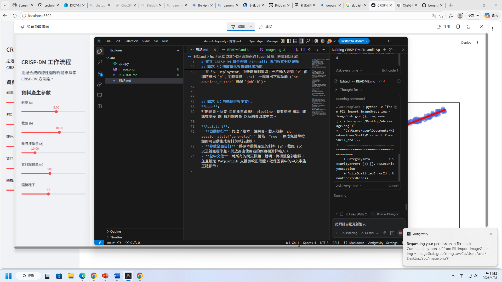

# CRISP-DM Linear Regression Streamlit App

這個應用程式示範了完整的 CRISP-DM (Cross-Industry Standard Process for Data Mining) 流程，並實作一個能自動訓練線性迴歸模型、產生評估指標與呈現視覺化的視覺化專案。

## 支援特色功能

* **全程繁體中文化**：包含專案標題、說明與 Matplotlib 圖表內的文字。
* **即時生成與預測**：在側邊欄任意調整斜率 (a)、截距 (b) 或資料點數量後，前端將自動快取並產生相對應全新的亂數散點分佈，馬上即時呈現 `y = ax + b + noise` 的最新線性擬合模型結果。
* **下載部署封包機能**：在專案流程「佈署 (Deployment)」階段，可直接將訓練後的模型及標準化變數一鍵下載為 `.pkl` (透過 joblib 封裝) 。

## Demo 畫面截圖



## 啟動平台

安裝必要的 Python 套件後，請執行以下語法掛載平台：

```bash
pip install streamlit numpy pandas scikit-learn matplotlib
streamlit run app.py
```
